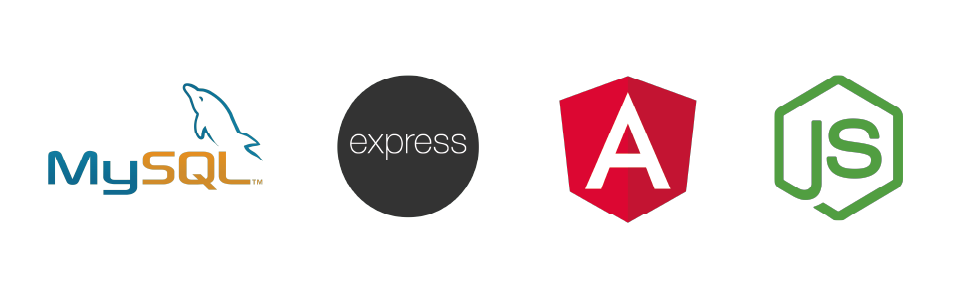
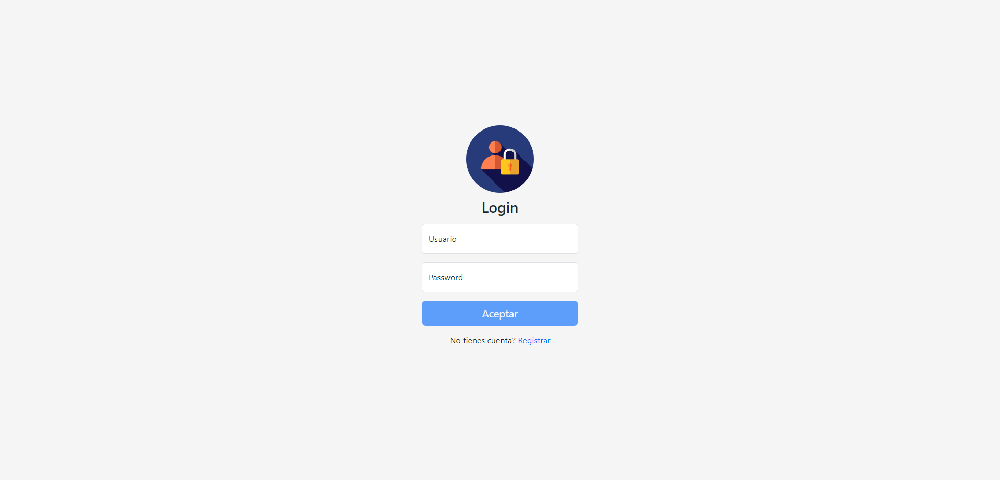
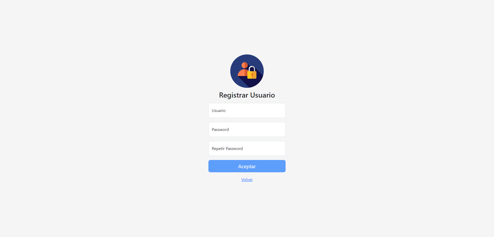
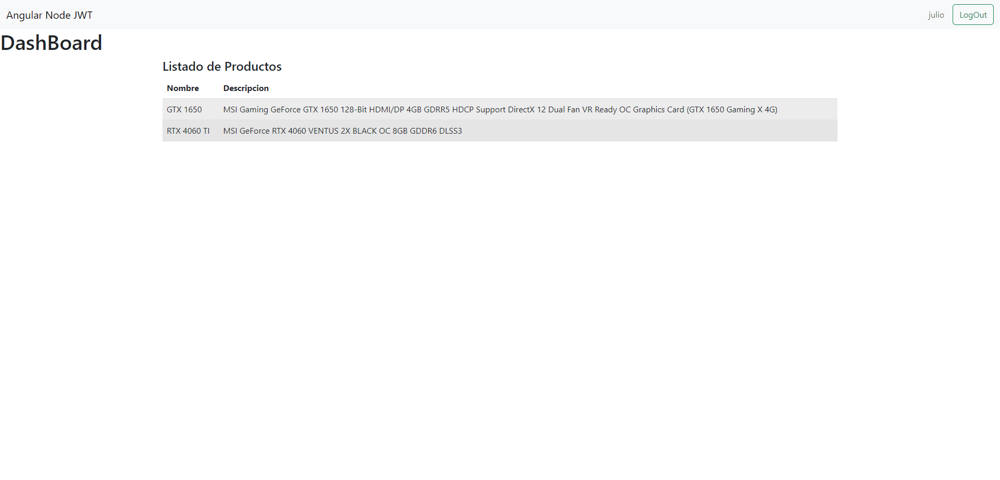

# Angular - Stack MEAN

Este proyecto se llevó a cabo utilizando el stack MEAN. El stack MEAN engloba las tecnologías MySQL, Express, Angular y Node.js, que combinadas nos permiten crear una solución integral y eficiente.

## Descripción

La aplicación consiste en una implementación de autenticación en Angular mediante JSON Web Tokens, que incluye la validación de rutas y la visualización de un listado de productos. Para el diseño, se utilizó [Bootstrap 5](https://getbootstrap.com/). Se empleó un ORM llamado Sequelize para gestionar la interacción con la base de datos y facilitar las operaciones de modelado y consulta en el proyecto.

## Tecnologías utilizadas

- [MySQL](https://www.mysql.com/)
- [Express](https://expressjs.com/)
- [Angular](https://angular.io/)
- [Node.js](https://nodejs.org/)
- [Sequelize](https://sequelize.org/)

## Capturas de pantalla

### Login

### Registro de Usuarios

### DashBoard con el Listado de Productos

¡Gracias por llegar hasta aquí y visitar mi proyecto! Quiero compartir contigo un logro importante que representa un verdadero viaje de aprendizaje para mí. En esta aplicación, he logrado implementar la autenticación con JSON Web Tokens (JWT) en Angular, utilizando el stack MEAN (MySql, Express, Angular y Node.js).

¡Felices codificaciones! 😄

